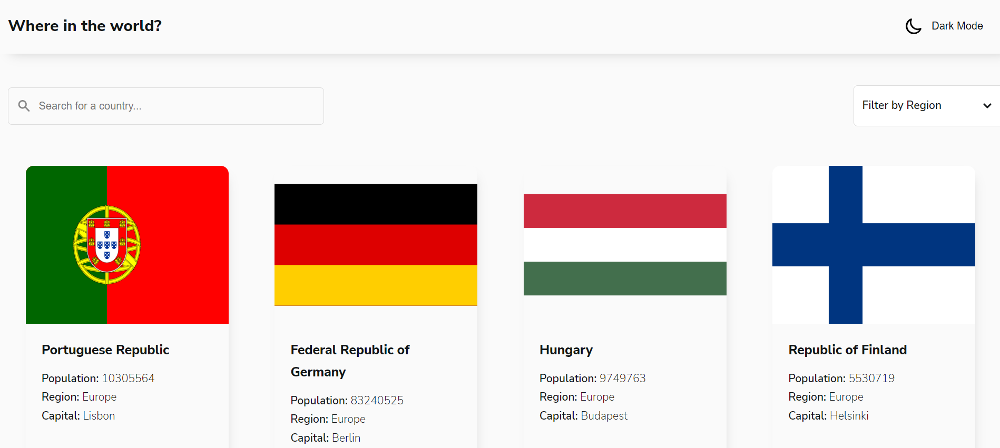

# Frontend Mentor - REST Countries API with color theme switcher

# Overview

A react application that uses the rest countries api to display all countries, and also allow the user to search a country, filter countries by region and view information about a specific country.

## The challenge

Your challenge is to integrate with the [REST Countries V2 API](https://restcountries.com/#api-endpoints-v2) to pull country data and display it like in the designs.

You can use any JavaScript framework/library on the front-end such as [React](https://reactjs.org) or [Vue](https://vuejs.org). You also have complete control over which packages you use to do things like make HTTP requests or style your project.

Your users should be able to:

-   See all countries from the API on the homepage
-   Search for a country using an `input` field
-   Filter countries by region
-   Click on a country to see more detailed information on a separate page
-   Click through to the border countries on the detail page
-   Toggle the color scheme between light and dark mode _(optional)_

## Installation

You can clone the repo to your local machine and run `npm start` to get the application running.

## Stack

-   React js
-   Sass
